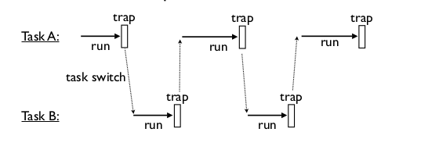

- [Посещаемость](#orgc93961e)
- [Что такое асинхронное программирование?](#orgd3cf6e2)
- [Пример синхронного программирования](#org810563f)
- [Пример асинхронного программирования](#org5ee59fc)
- [Что такое генераторы в Python](#org2194177)
- [Генераторы](#orge6fc9b1)
- [Генераторы](#orge25d4b7)
- [Генераторы](#org9f7d223)
- [Генераторы как контекстные менеджеры](#org29c204a)
- [Пример использования генераторов](#orgf7b7291)
- [Пример использования генераторов](#orgf8d143c)
- [Пример использования генераторов](#orgddb97c5)
- [Пример использования генераторов](#org3fcd46d)
- [Пример использования генераторов](#orgf85a7d6)
- [Корутины это генераторы](#org933bae2)
- [Корутины](#orge1f2e52)
- [Пример использования корутин](#orga19c0c2)
- [Пример использования корутин](#org4ca3c85)
- [Task scheduling](#org38af4e2)
- [Task](#org0d9768e)
- [Task example](#org6d5b735)
- [Scheduler](#orge0c206a)
- [Scheduler](#org24be32d)
- [Scheduler example](#org98dfa7c)
- [Scheduler Exit](#org8f223ed)
- [Scheduler example](#orga035466)
- [Дополнительные материалы](#org2af2949)
- [AsyncIO](#org15d9253)
- [AsyncIO event loop](#org5532f1e)
- [Запуск sync в async](#org77474a6)
- [Запуск async в sync](#org7045ed3)
- [Запуск async в sync](#orgea7c056)
- [Запуск async в Jupyter](#orgd8a0ae2)
- [Дополнительная литература](#org90c776e)
- [Вопросы-ответы](#orga8c6061)


<a id="orgc93961e"></a>

# Посещаемость

[https://practicum.yandex.ru/webinar-form/python-developer-plus/](https://practicum.yandex.ru/webinar-form/python-developer-plus/)  

  


<a id="orgd3cf6e2"></a>

# Что такое асинхронное программирование?

> концепция программирования, которая заключается в том, что результат выполнения функции доступен не сразу же, а через некоторое время в виде некоторого асинхронного (нарушающего обычный порядок выполнения) вызова.  

<div class="org-center">
<p>
<span class="underline"><span class="underline"><a href="https://ru.wikipedia.org/wiki/%25D0%2590%25D1%2581%25D0%25B8%25D0%25BD%25D1%2585%25D1%2580%25D0%25BE%25D0%25BD%25D0%25BD%25D0%25BE%25D0%25B5_%25D0%25BF%25D1%2580%25D0%25BE%25D0%25B3%25D1%2580%25D0%25B0%25D0%25BC%25D0%25BC%25D0%25B8%25D1%2580%25D0%25BE%25D0%25B2%25D0%25B0%25D0%25BD%25D0%25B8%25D0%25B5">Wiki</a></span></span><br />
</p>
</div>


<a id="org810563f"></a>

# Пример синхронного программирования

```python

def func(x, y):
  import time
  time.sleep(1)
  return x + y
def run():
  fut = pool.submit(func, 2, 3)
  r = fut.result()
  print('Got:', r)
run()
print("DONE")
```

    - Got: 5
    - DONE


<a id="org5ee59fc"></a>

# Пример асинхронного программирования

```python

def result_handler(fut):
    result = fut.result()
    print('Got:', result)
def run():
    fut = pool.submit(func, 2, 3)
    fut.add_done_callback(
        result_handler
    )
run()
print("DONE")
```

    - DONE
    - Got: 5


<a id="org2194177"></a>

# Что такое генераторы в Python

**Генератор** это функция, которая производит *последовательность результатов* а не единичный ответ.  

```python
print(str(x) for x in range(10))
```

    - <generator object <genexpr> at 0x7f5166f87ac0>

```python
def countdown(n):
    while n > 0:
        yield n
        n -= 1
for i in countdown(3):
    print(i, sep='', end='...')
```

    - 3...2...1...


<a id="orge6fc9b1"></a>

# Генераторы

Python понимает, что функция это генератор по наличию в функции метода **yield**.  
  
Генераторы не запускаются автоматически при вызове, а только инициализируются  

```python
def countdown(n):
    print(f"Обратный отсёт для {n}")
    while n > 0:
        yield n
        # точка остановки
        n -= 1
g = countdown(3)
print(g)
```

    - <generator object countdown at 0x7fd754de6e40>


<a id="orge25d4b7"></a>

# Генераторы

Чтобы запустить генератор, надо вызывать метод **next**  

```python

g = countdown(3)
next(g)
```

    - Обратный отсёт для 3


<a id="org9f7d223"></a>

# Генераторы

Генератор будет работать до тех пор пока не случится **return**  

```python

g = countdown(2)
print(next(g))
print(next(g))
try:
    print(next(g))
except StopIteration:
    print("КОНЕЦ")
```

    - Обратный отсёт для 2
    - 2
    - 1
    - КОНЕЦ


<a id="org29c204a"></a>

# Генераторы как контекстные менеджеры

```python
from contextlib import contextmanager
import time

@contextmanager
def timeit():
    import time
    try:
        start = time.time()
        yield start
    finally:
        end = time.time()
        print(f"{end-start:.2f}")
with timeit():
    time.sleep(2)
```

    2.00


<a id="orgf7b7291"></a>

# Пример использования генераторов

В Bash можно направлять результат работы одной программы в другую, причём данные в первую программу могут поступать даже после запуска *пайпа*  

```shell
# на случай если такого файла
# не существовало
# или в нём что-то уже было,
# запишем в него пустоту
:> /tmp/t.txt
# tail -f => "follow" новые строки
#                     в файле
# grep -i python => искать вхождение
#                   подстроки python
tail -f /tmp/t.txt | grep -i python
```


<a id="orgf8d143c"></a>

# Пример использования генераторов

Как реализовать такое на Python?  

```python
def follow(filepath, grepper):
    with open(filepath, "r") as fd:
        # "сикнемся" в конец файла
        fd.seek(0, 2)
        while True:
            line = fd.readline()
            if not line:
                # небольшая пауза
                time.sleep(0.1)
                continue
            grepper(line)

```


<a id="orgddb97c5"></a>

# Пример использования генераторов

```python

def grep(pattern, lines):
    pattern = pattern.lower()
    for line in lines:
        if pattern in line.lower():
            yield line
```


<a id="org3fcd46d"></a>

# Пример использования генераторов

```python

def follow(filepath):
    with open(filepath, "r") as fd:
        fd.seek(0, 2)
        while True:
            line = fd.readline()
            if not line:
                time.sleep(0.1)
                continue
            yield line
```

```python

for line in grep("org", grep(
    "python", follow("/tmp/t.txt")
)):
    print(line)
```


<a id="orgf85a7d6"></a>

# Пример использования генераторов

```python

with open(
  "/usr/share/doc/python3.10/copyright"
) as fd:
  print(
    '\n'.join(grep(
        "http",
        grep("python", fd.readlines())
      )
    )
  )
```


<a id="org933bae2"></a>

# Корутины это генераторы

На самом деле **yield** принимает значение и возвращает его внутрь генератора.  

```python

# docs.python.org/3/library/typing.html
G = Generator[int, int, None]
def countdown(n) -> G:
    while n > 0:
        shift = (yield n)
        n -= 1
        if shift is not None:
            n += shift
g = countdown(1)
print(next(g))
print(g.send(10))
```

    - 1
    - 10


<a id="orge1f2e52"></a>

# Корутины

В корутины можно передать эксепшен  

```python
def cor(n):
    while n > 0:
        try:
            yield n
            n -= 1
        except ValueError:
            print("Поймал!")
g = cor(3)
next(g)
g.throw(ValueError, "foobar")
```

    - Поймал!


<a id="orga19c0c2"></a>

# Пример использования корутин

```python

def follow(filepath, target):
    with open(filepath, "r") as fd:
        fd.seek(0,2)
        while True:
            line = fd.readline()
            if not line:
                time.sleep(0.1)
                continue
            target.send(line)
```


<a id="org4ca3c85"></a>

# Пример использования корутин

```python

@coroutine
def printer():
    while True:
        line = (yield)
        print(line)
```

```python

@coroutine
def broadcast(targets):
    while True:
        item = (yield)
        for target in targets:
            target.send(item)
follow("/tmp/t.txt", broadcast(
    [printer(), printer()]))
```


<a id="org38af4e2"></a>

# Task scheduling

  


<a id="org0d9768e"></a>

# Task

```python
class Task:
    task_id = 0
    def __init__(self, target):
        Task.task_id += 1
        self.tid = Task.task_id
        # target coroutine
        self.target = target
        # value to send
        self.sendval = None
    def run(self):
        return self.target.send(
            self.sendval
        )
```


<a id="org6d5b735"></a>

# Task example

```python

def foo():
    for i in range(2):
        yield i
t1 = Task(foo())
print(t1.run())
print(t1.run())
```

    - 0
    - 1


<a id="orge0c206a"></a>

# Scheduler

```python
from queue import Queue

class Scheduler:
    def __init__(self):
        self.ready = Queue()
        self.taskmap = {}

    def new(self, target):
        newtask = Task(target)
        self.taskmap[newtask.tid] \
            = newtask
        self.schedule(newtask)
        return newtask.tid
```


<a id="org24be32d"></a>

# Scheduler

```python
def schedule(self,task):
    self.ready.put(task)

def mainloop(self):
    while self.taskmap:
        task = self.ready.get()
        result = task.run()
        self.schedule(task)
```


<a id="org98dfa7c"></a>

# Scheduler example

```python

def foo():
    while True:
        print("I'm foo")
        yield

def bar():
    while True:
        print("I'm bar")
        yield

sched = Scheduler()
sched.new(foo())
sched.new(bar())
sched.mainloop()
```


<a id="org8f223ed"></a>

# Scheduler Exit

```python
def exit(self,task):
    print(f"Task {task.tid} terminated")
    del self.taskmap[task.tid]

def mainloop(self):
     while self.taskmap:
        task = self.ready.get()
        try:
            _ = task.run()
        except StopIteration:
            self.exit(task)
            continue
        self.schedule(task)
```


<a id="orga035466"></a>

# Scheduler example

```python

def foo(n):
    for i in range(n):
        print("I'm foo")
        yield

def bar(n):
    for i in range(n):
        print("I'm bar")
        yield

sched = Scheduler()
sched.new(foo(2))
sched.new(bar(2))
sched.mainloop()
```


<a id="org2af2949"></a>

# Дополнительные материалы

<span class="underline"><span class="underline">[dabeaz.com](http://www.dabeaz.com/coroutines/)</span></span>  
  
*презентация старая, там используется Python2, будьте внимательны, синтаксис немного отличается!*  


<a id="org15d9253"></a>

# AsyncIO

```python
import time
import asyncio
async def count():
    print("One")
    await asyncio.sleep(1)
    print("Two")
async def main():
    await asyncio.gather(
        count(), count()
    )
asyncio.run(main())
```

    - One
    - One
    - Two
    - Two


<a id="org5532f1e"></a>

# AsyncIO event loop

```python
loop = asyncio.get_event_loop()
try:
    loop.run_until_complete(main())
finally:
    loop.close()
```


<a id="org77474a6"></a>

# Запуск sync в async

```python
import asyncio
from requests import get
from contextlib import asynccontextmanager

@asynccontextmanager
async def web_page(url):
    loop = asyncio.get_event_loop()
    yield await loop.run_in_executor(
        None, get, url)
async def main():
    async with web_page(
            "https://ya.ru") as data:
        print(data.content.decode("utf-8"))
loop = asyncio.get_event_loop()
loop.run_until_complete(main())
```


<a id="org7045ed3"></a>

# Запуск async в sync

```python
# async downloader
async def rng(n):
    for i in range(n):
        yield i

async def foo(n):
    async for i in rng(n):
        print(i)
```


<a id="orgea7c056"></a>

# Запуск async в sync

```python

# sync scheduler
def task(n):
    import asyncio
    loop = asyncio.get_event_loop()
    loop.run_until_complete(foo(n))

# register sync task in the sceduler
task(5)
```

    0
    1
    2
    3
    4


<a id="orgd8a0ae2"></a>

# Запуск async в Jupyter

<span class="underline"><span class="underline">[Проблема](https://colab.research.google.com/drive/1uEcXaw_YCPLN2o8X0LefR7EZ_0hog0Tq#scrollTo=5yzPk0x9k23g)</span></span>  
<span class="underline"><span class="underline">[Обсуждение](https://stackoverflow.com/questions/47518874/how-do-i-run-python-asyncio-code-in-a-jupyter-notebook)</span></span>  

```python
# скорее всего даже не надо
%autowait asyncio

await foo(5)
```


<a id="org90c776e"></a>

# Дополнительная литература

-   <span class="underline"><span class="underline">[AsyncIO in Python](https://realpython.com/async-io-python/)</span></span>
-   <span class="underline"><span class="underline">[Using AsyncIO in Python](https://www.oreilly.com/library/view/using-asyncio-in/9781492075325/)</span></span>


<a id="orga8c6061"></a>

# Вопросы-ответы


